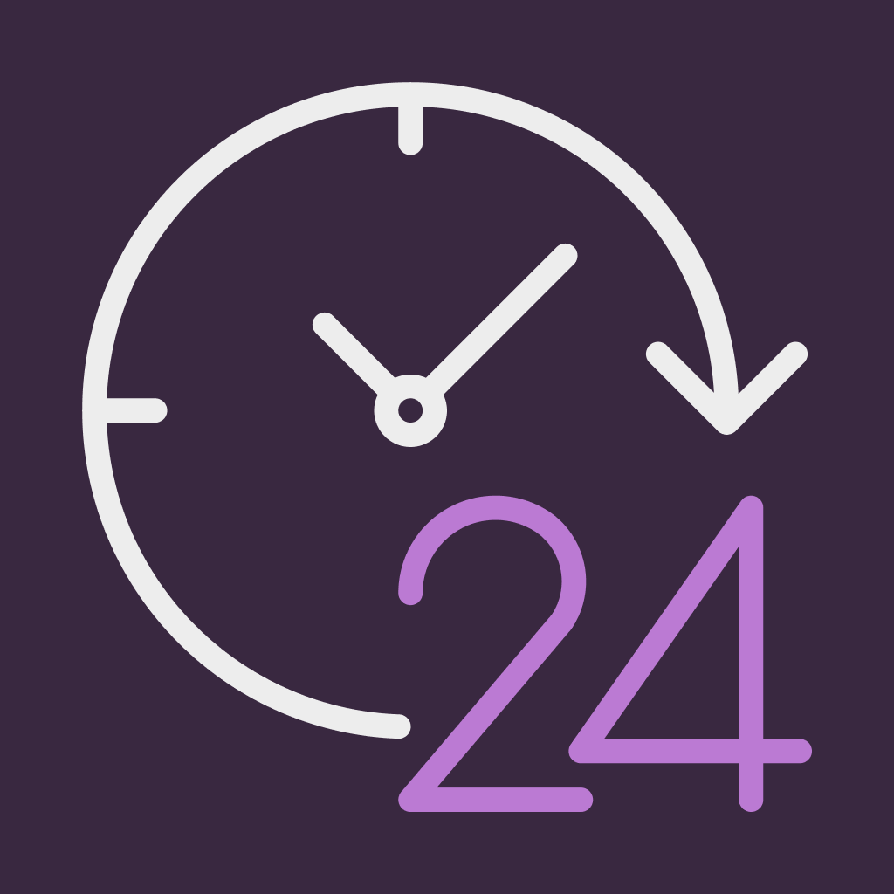

# Registra Lá - Aplicativo de Registro de Ponto



## Sobre o Aplicativo

O **Registra Lá** é um aplicativo móvel desenvolvido com Expo/React Native para registro e controle de ponto eletrônico. Projetado para facilitar o registro de horas trabalhadas, o aplicativo oferece uma interface intuitiva e recursos avançados para gerenciamento de jornada de trabalho.

## Principais Funcionalidades

### Registro de Ponto

- Registro de entrada e saída com captura de foto
- Reconhecimento automático de data e hora através de IA (Gemini API)
- Suporte a diferentes tipos de registro: trabalho, folga e atestado
- Opção para registro de dia completo

### Controle de Horas

- Cálculo automático de horas trabalhadas
- Visualização de saldo de horas (positivo ou negativo)
- Configuração de jornada de trabalho e tolerância
- Histórico completo de registros

### Personalização

- Configuração de horas de trabalho diárias
- Definição de tolerância para saldo de horas
- Configuração de tempo de intervalo
- Seleção de dias de trabalho na semana
- Suporte a tema claro e escuro

### Tecnologia Avançada

- Integração com IA para extração de dados de imagens (Google Gemini API)
- Armazenamento local seguro com SQLite e Drizzle ORM
- Interface responsiva e moderna

## Tecnologias Utilizadas

- **Frontend**: React Native, Expo, NativeWind (Tailwind CSS)
- **Banco de Dados**: SQLite com Drizzle ORM
- **Inteligência Artificial**: Google Gemini API para processamento de imagens
- **Navegação**: Expo Router

## Começando

### Pré-requisitos

- Node.js (versão 16 ou superior)
- Expo CLI
- Yarn ou NPM

### Instalação

1. Clone o repositório

   ```bash
   git clone https://github.com/seu-usuario/registra-la.git
   cd registra-la
   ```

2. Instale as dependências

   ```bash
   npm install
   # ou
   yarn install
   ```

3. Inicie o aplicativo

   ```bash
   npx expo start
   ```

## Configuração Inicial

Ao iniciar o aplicativo pela primeira vez, você será direcionado para a tela de configuração onde poderá definir:

- Horas de trabalho diárias
- Tolerância para saldo de horas
- Nome da empresa
- Tempo de intervalo
- Dias de trabalho na semana
- Chave da API Gemini (opcional, para reconhecimento automático de dados em fotos)

## Uso do Aplicativo

1. **Página Inicial**: Visualize o histórico de registros do dia e o saldo de horas
2. **Registro de Ponto**: Toque no botão + para adicionar um novo registro
3. **Configurações**: Acesse as configurações para personalizar o aplicativo

## Contribuição

Contribuições são bem-vindas! Sinta-se à vontade para abrir issues ou enviar pull requests para melhorar o aplicativo.

## Licença

Este projeto está licenciado sob a licença MIT - veja o arquivo LICENSE para mais detalhes.

---

Desenvolvido com ❤️ para facilitar o controle de ponto e registro de horas trabalhadas.
